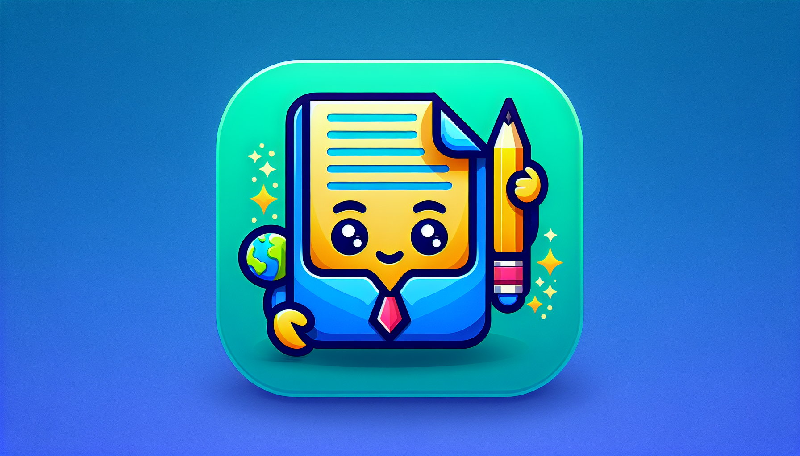

<div id="top">

<div align="center">



# V-CHATGPT-EDITOR

<em>Careful Manuscript Editing and Translation, Powered by OpenAI</em>


<em>Built with Python, DOCX tooling, and the OpenAI API</em>

</div>

---

## Table of Contents

1. [Overview](#overview)
2. [Features](#features)
3. [Project Structure](#project-structure)
4. [Getting Started](#getting-started)
5. [Configuration](#configuration)
6. [Command-Line Usage](#command-line-usage)
7. [Tests](#tests)
8. [License](#license)

---

## Overview

V-ChatGPT-Editor is a command-line tool for editing and translating DOCX manuscripts. It divides documents into paragraph-preserving sections, sends those sections to OpenAI for processing, and rebuilds a formatted DOCX file. Intermediate sections are retained so processing can be resumed or the final document rebuilt separately.

---

## Features

| Component | Details |
| :--- | :--- |
| **Editing and translation** | Edit manuscripts with minimal changes or translate them into a selected language. |
| **DOCX processing** | Split and merge documents while preserving paragraph formatting and markup. |
| **Section sizing** | Set a model-token budget per section; oversized paragraphs remain intact. |
| **OpenAI integration** | Use the Responses API with configurable model, organization, and project settings. |
| **Resumable workflow** | Keep intermediate section files under `app/tmp/` and build completed DOCX files from them. |
| **Concurrency** | Configure the maximum number of sections processed concurrently. |
| **Testing** | Run the standard-library `unittest` suite in `tests/`. |

---

## Project Structure

```text
v-chatgpt-editor/
├── app/
│   ├── api.py              # OpenAI client and requests
│   ├── docx_handler.py     # DOCX splitting, processing, and merging
│   ├── docx_markup.py      # Paragraph markup serialization and restoration
│   ├── main.py             # Command-line entry point
│   ├── token_count.py      # Model token counting
│   ├── requirements.txt    # Python dependencies
│   ├── run.sh              # Interactive setup and edit/translate workflow
│   ├── .env                # Local configuration; create this file yourself
│   ├── input/              # Source DOCX files
│   ├── output/             # Completed DOCX files
│   └── tmp/                # Intermediate sections and processing state
├── tests/                  # unittest test suite
├── LICENSE
└── README.md
```

---

## Getting Started

### Requirements

- Python 3
- Bash for the interactive script (use Git Bash or WSL on Windows)
- An OpenAI API key for editing and translation

### Interactive Setup

`run.sh` is an interactive wrapper for editing or translating a manuscript. Put the `.docx` files you want to process in `app/input/`, create `app/.env` with your OpenAI API key, and start the helper from the repository root:

```sh
bash app/run.sh
```

The helper locates its own directory and switches to `app/`, so its paths do not depend on the directory you launched it from. It checks for `app/venv/`, creates the virtual environment if needed, installs the packages in `app/requirements.txt`, and activates it. Dependencies are checked with `pip` each time you start the helper.

After setup, it asks whether to **Edit** or **Translate**, then shows the `.docx` files in `app/input/` for selection. If the directory has no Word documents, the helper stops with a message. It next asks for a section token budget of `256`, `512`, `1024`, or `2048`. This budget applies to serialized manuscript text; paragraphs are kept intact, so a long paragraph can exceed the selected budget. An unrecognized budget choice falls back to `256`.

For translation, the helper also asks for a target language. It then invokes `main.py` with the selected file and options: edit runs the editing workflow, while translate sends the target language to the translation workflow. Both workflows call the OpenAI API, save intermediate sections in a per-document workspace under `app/tmp/`, and build the final DOCX in `OUTPUT_DIR` (by default `app/output/`). Edited files are prefixed `EDITED_`; translation files use the target language as an uppercase prefix.

The helper only offers edit and translate. To rebuild a document from sections that have already been processed, use the `build` command described below. The script stops if a command fails and deactivates the virtual environment after a normal run. On Windows, run it in Git Bash or WSL.

---

## Configuration

Create `app/.env` with the settings you need:

```env
OPENAI_API_KEY=your-api-key
OPENAI_PROJECT_ID=
OPENAI_ORG=
MODEL=gpt-5-mini
MAX_CONCURRENT_SECTIONS=1
OUTPUT_DIR=./output
```

`OPENAI_API_KEY` is required for edit and translate commands. `MODEL` defaults to `gpt-5-mini`, `MAX_CONCURRENT_SECTIONS` defaults to `1`, and `OUTPUT_DIR` defaults to `./output`. Keep `app/.env` private and do not commit API credentials.

When running Python commands directly, run them from `app/` so `.env` is discovered and relative paths resolve there.

---

## Command-Line Usage

After installing the dependencies, run commands from `app/`:

```sh
python main.py edit input/manuscript.docx 512
python main.py translate input/manuscript.docx French 512
python main.py build input/manuscript.docx --edited
python main.py build input/manuscript.docx --language French
```

The `build` command rebuilds a document from existing intermediate sections and does not require an API key. Edit and translate commands build their output when processing completes. The interactive workflow is also available from the repository root with `bash app/run.sh`.

---

## Tests

Install the dependencies listed in `app/requirements.txt`, then run from the repository root:

```sh
python -m unittest discover -s tests -v
```

---

## License

This project is licensed under the MIT License. See [LICENSE](LICENSE).

<div align="right"><a href="#top">Back to top</a></div>