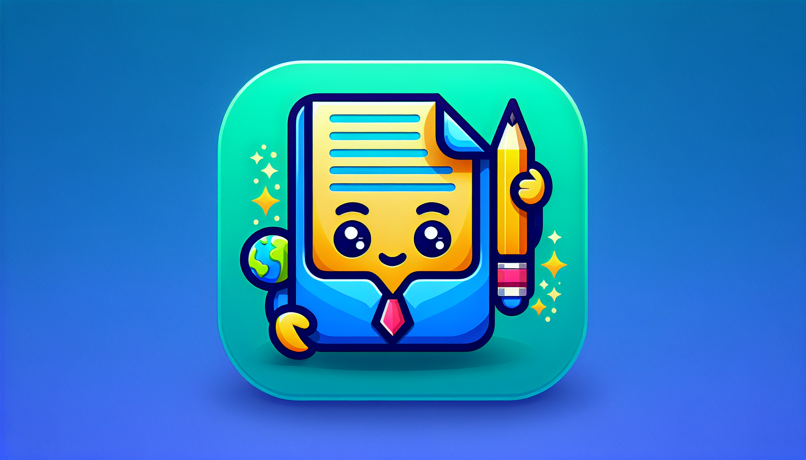

<p align="center">
  
</p>
<p align="center"><h1 align="center"><code>❯ v-chatgpt-editor</code></h1></p>
<p align="center"><em>Transforming Manuscripts, Empowering Creativity!</em></p>

## 🔗 Table of Contents

- [📍 Overview](#-overview)
- [👾 Features](#-features)
- [📁 Project Structure](#-project-structure)
- [🚀 Getting Started](#-getting-started)
  - [☑️ Prerequisites](#-prerequisites)
  - [⚙️ Installation](#-installation)
  - [🤖 Usage](#-usage)
- [🎗 License](#-license)

## 📍 Overview

`v-chatgpt-editor` automates editing and translation for DOCX manuscripts. It splits large documents, processes each section with the OpenAI API, and merges the results into a final file while preserving layout and style.

## 👾 Features

- Split and merge DOCX manuscripts for manageable processing.
- Synchronous interaction with the OpenAI API for editing and translation.
- Command-line interface with `edit`, `translate`, `build`, and `cleanup` subcommands.
- Validation script `app/validate_improvements.py` to verify repository improvements.
- Dependencies (`app/requirements.txt`): `argparse`, `python-docx`, `python-dotenv`, `beautifulsoup4`, `openai`.

## 📁 Project Structure

```text
.
├── AGENT.md
├── CHANGELOG.md
├── IMPROVEMENTS.md
├── LICENSE
├── README.md
├── app
│   ├── api.py
│   ├── docx_handler.py
│   ├── input/
│   ├── main.py
│   ├── requirements.txt
│   ├── run.sh
│   └── validate_improvements.py
└── v-chatgpt-editor.png
```

## 🚀 Getting Started

### ☑️ Prerequisites

- Python
- Pip

### ⚙️ Installation

Clone the repository and install dependencies:

```sh
git clone <repository-url>
cd v-chatgpt-editor
pip install -r app/requirements.txt
```

Create a `.env` file inside `app/` with the following keys:

```env
OPENAI_PROJECT_ID=<your-project-id>
OPENAI_API_KEY=<your-api-key>
MODEL=gpt-4o-mini
OUTPUT_DIR=./output
```

### 🤖 Usage

Run the interactive script:

```sh
bash app/run.sh
```

Or call the CLI directly:

```sh
# Edit a DOCX in four sections
python app/main.py edit manuscript.docx 4

# Translate to Spanish in four sections
python app/main.py translate manuscript.docx es 4

# Merge processed sections into a final file
python app/main.py build manuscript.docx

# Remove temporary files
python app/main.py cleanup manuscript.docx
```

Validate repository improvements:

```sh
python app/validate_improvements.py
```

## 🎗 License

This project is under the [MIT License](LICENSE).

